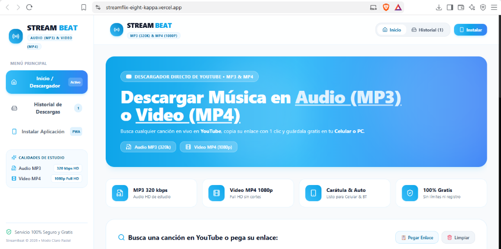
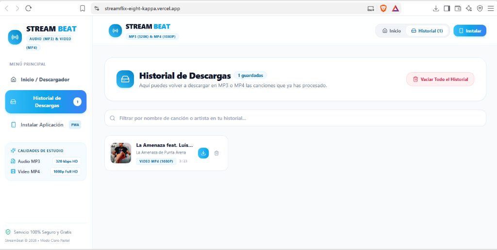
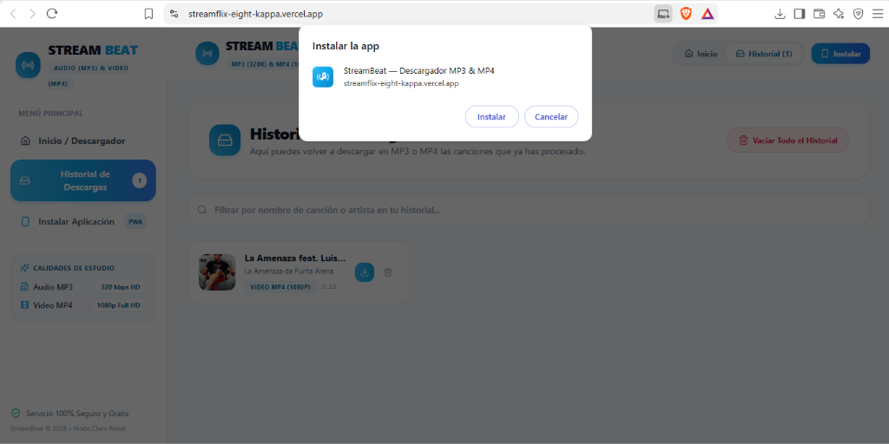

# 🎵 StreamBeat (StreamFlix) — Plataforma Multimedia & Descargas HD

<p align="center">
  
</p>

<p align="center">
  <a href="https://reactjs.org/"></a>
  <a href="https://vitejs.dev/"></a>
  <a href="https://tailwindcss.com/"></a>
  <a href="https://web.dev/progressive-web-apps/"></a>
  <a href="#-características"></a>
  <a href="LICENSE"></a>
</p>

<p align="center">
  <strong>StreamBeat</strong> es una aplicación web progresiva (PWA) moderna, rápida y 100% responsiva diseñada para la búsqueda, streaming en vivo y descarga de audio en alta fidelidad (<strong>MP3 hasta 320 kbps</strong>) y video en alta definición (<strong>MP4 hasta 1080p FHD</strong>).
</p>

---

## 📸 Galería de la Aplicación

La interfaz ha sido diseñada cuidando cada detalle visual, con soporte completo para dispositivos móviles, tablets y computadoras de escritorio.

| 🖥️ Interfaz Principal & Descargas | 📂 Historial & Biblioteca Local |
| :---: | :---: |
|  |  |
| *Buscador en tiempo real, detección de links, selección de calidad (320k, 256k, 192k, 128k) y previsualización de audio.* | *Gestor de descargas con búsqueda rápida, reproducción de pistas descargadas y exportación directa.* |

<br/>

<div align="center">
  <h3>📲 Experiencia Nativa con Instalación PWA</h3>
  <p>Instalable con un solo clic en Android, iOS, Windows y macOS, funcionando offline y sin necesidad de tiendas de aplicaciones.</p>
  
</div>

---

## ✨ Características Destacadas

- 🔍 **Buscador Universal y Extracción Inteligente:**
  - Búsqueda en tiempo real de pistas, artistas y álbumes.
  - Detección y parseo automático de enlaces de YouTube (videos, Shorts, playlists y enlaces móviles).
- 🎧 **Audio en Máxima Fidelidad (MP3):**
  - Descarga en 320 kbps (Master Quality), 256 kbps (Estudio), 192 kbps (Estándar) y 128 kbps (Ahorro).
- 🎬 **Video en Alta Definición (MP4):**
  - Soporte para descargas en 720p HD y 1080p Full HD con audio integrado.
- 📱 **Diseño 100% Responsivo & Mobile-First:**
  - Optimizado para pantallas pequeñas (desde 320px) hasta monitores ultrawide.
  - Safe-area insets (`env(safe-area-inset-bottom)`) para iPhone y dispositivos con barra de gestos.
  - Menús adaptativos y barra de navegación inferior (`bottom-navigation`) con prevención de solapamiento.
- 🎛️ **Herramientas de Estudio Integradas:**
  - **Bass Booster & Ecualizador:** Ajuste dinámico de frecuencias graves y ganancia de sonido.
  - **Cortador de Tonos (Ringtone Maker):** Recorta fragmentos de cualquier pista para tonos de llamada.
  - **Códigos QR Instantáneos:** Genera un código QR de descarga directa para escanearlo desde el móvil.
  - **Letras Sincronizadas:** Visualización de lyrics para cantar tus canciones preferidas.
- 💾 **Historial & Privacidad:**
  - Persistencia total en el navegador (`localStorage`) sin recolectar datos personales ni requerir registro.

---

## 🏗️ Estructura del Proyecto

```plaintext
streamflix/
├── 📁 api/                       # Funciones Serverless (Vercel)
│   ├── download.js               # Enrutador y procesador de peticiones de descarga
│   └── stream.js                 # Streamer de audio y video
├── 📁 docs/                      # Recursos de documentación
│   └── 📁 images/                # Capturas de pantalla oficiales
│       ├── screenshot-home.png
│       ├── screenshot-history.png
│       └── screenshot-install.png
├── 📁 public/                    # Archivos estáticos y PWA
│   ├── favicon.ico
│   ├── icon-192.png / icon-512.png
│   └── manifest.json             # Web App Manifest
├── 📁 src/                       # Código fuente de React
│   ├── 📁 components/            # Componentes modulares
│   │   ├── AudioEffectsModal.jsx # Ecualizador y Bass Booster
│   │   ├── AudioVisualizer.jsx   # Visualizador de ondas de sonido
│   │   ├── DownloadModal.jsx     # Selector de formatos y calidades
│   │   ├── DownloadsView.jsx     # Vista principal de búsqueda y descargas
│   │   ├── HistoryView.jsx       # Historial y gestión de archivos descargados
│   │   ├── HomeView.jsx          # Feed de descubrimiento
│   │   ├── InstallModal.jsx      # Guía de instalación PWA multiplataforma
│   │   ├── LibraryView.jsx       # Biblioteca personal
│   │   ├── LyricsModal.jsx       # Visualizador de letras
│   │   ├── Navbar.jsx            # Barra superior responsiva
│   │   ├── Player.jsx            # Reproductor multimedia persistente
│   │   ├── QRCodeModal.jsx       # Generador de códigos QR para descarga móvil
│   │   ├── RingtoneModal.jsx     # Cortador de fragmentos de audio
│   │   ├── SearchView.jsx        # Vista de exploración
│   │   ├── ShareModal.jsx        # Diálogo para compartir enlaces
│   │   └── Sidebar.jsx           # Navegación lateral colapsable
│   ├── 📁 services/              # Integraciones y APIs
│   │   └── musicService.js       # Proveedores de búsqueda y metadatos
│   ├── App.jsx                   # Componente central y gestión de rutas/vistas
│   ├── index.css                 # Estilos globales y utilidades Tailwind
│   └── main.jsx                  # Entrada React DOM
├── index.html                    # HTML5 Template con meta tags responsivos
├── package.json                  # Dependencias del proyecto
├── tailwind.config.js            # Configuración de breakpoints y temas
├── vercel.json                   # Configuración para despliegue en Vercel
└── vite.config.js                # Configuración de Vite
```

---

## 🚀 Instalación y Puesta en Marcha

### Prerrequisitos
- [Node.js](https://nodejs.org/) (versión 18.x o superior recomendada)
- [npm](https://www.npmjs.com/) o [yarn](https://yarnpkg.com/)

### Pasos:

1. **Clonar o ingresar al directorio del proyecto:**
   ```bash
   cd streamflix
   ```

2. **Instalar las dependencias:**
   ```bash
   npm install
   ```

3. **Ejecutar el entorno de desarrollo:**
   ```bash
   npm run dev
   ```
   Abre [http://localhost:5173](http://localhost:5173) en tu navegador para ver la aplicación.

4. **Compilar para producción:**
   ```bash
   npm run build
   ```

---

## 🌐 Despliegue en Vercel

El proyecto cuenta con configuración lista para desplegar en Vercel con soporte para las funciones API:

```bash
# Iniciar sesión y desplegar con Vercel CLI
npx vercel
```

---

## 🛠️ Stack Tecnológico

| Tecnología | Descripción |
| :--- | :--- |
| **React 18** | Biblioteca para interfaces de usuario reactivas |
| **Vite** | Entorno de desarrollo ultrarrápido y bundler |
| **Tailwind CSS** | Framework CSS utility-first con soporte para temas |
| **Lucide React** | Set de iconos vectoriales modernos y limpios |
| **PWA Web API** | Notificaciones, manifests y modo standalone |

---

## 📄 Licencia

Este proyecto está bajo la Licencia **MIT**. Consulta el archivo `LICENSE` para más detalles.
